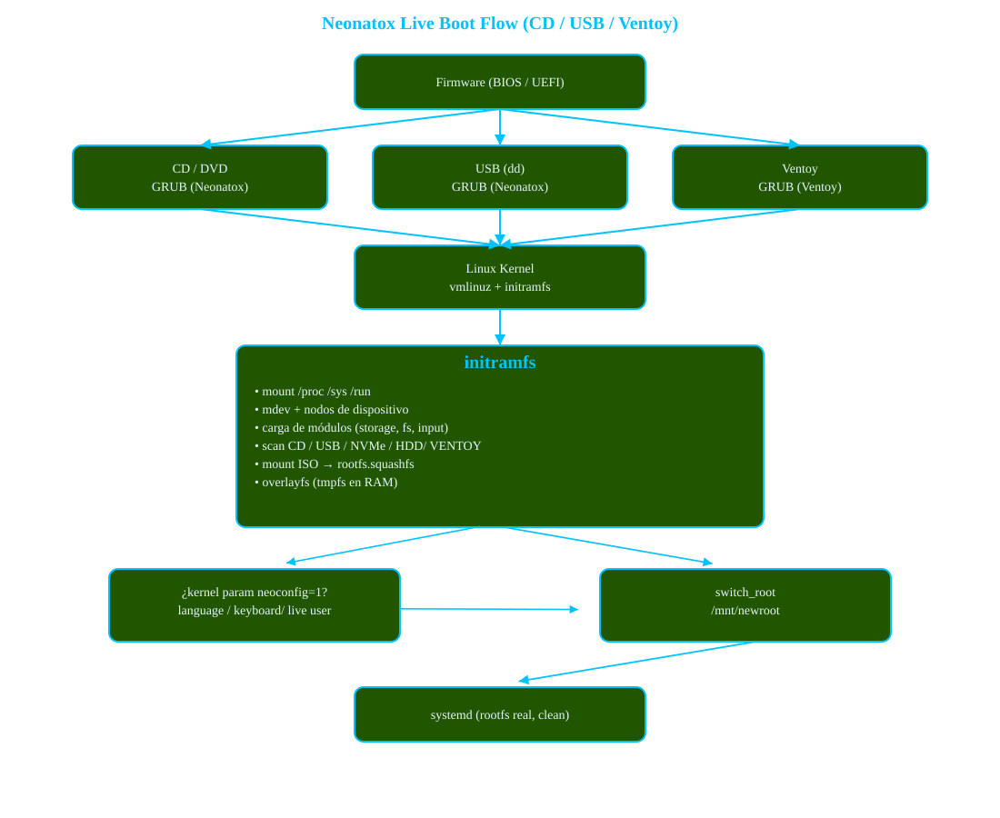

# Neonatox Live Boot

Neonatox Live Boot is a minimal, educational, and production-capable live boot system designed to demonstrate how a modern Linux live environment works internally, without relying on large frameworks such as dracut or live-build. 

This project is primarily intended for: 

  * People learning how the Linux boot process really works
  * Students of LFS / BLFS-style systems
  * Developers interested in live systems and initramfs design

While Neonatox Live Boot is fully functional and robust, it is also deliberately designed to be readable, hackable, and understandable. 

## Documentation Index

1. [Overview & Philosophy](01-overview.md)
2. [Boot Flow](02-boot-flow.md)  
3. [Initramfs Design](03-initramfs-design.md)
4. [Device Detection](04-device-detection.md)
5. [OverlayFS and Root Filesystem](05-overlayfs.md)
6. [systemd Handoff](06-systemd-handoff.md)
7. [Debugging & Common Errors](07-debugging.md)
8. [Ventoy Integration](08-ventoy-support.md)
9. [Live Configuration](09-live-config.md)
10. [Boot Modes](10-boot-modes.md)

## Boot Flow

All documentation reflects real-world trial, error, and debugging performed during development of Neonatox Live Boot. 
